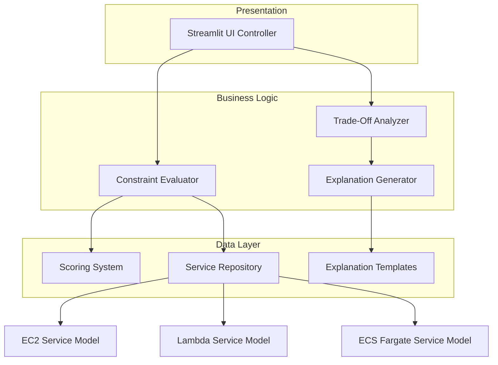

# Design Document

## Overview

The Cloud Service Referee is a Python-based Streamlit application that provides neutral, educational comparisons of AWS compute services (EC2, Lambda, ECS Fargate). Rather than declaring a single "best" choice, the system acts as an impartial referee, evaluating each service independently against user-defined constraints and explaining trade-offs to help users make informed decisions.

The application follows a constraint-based evaluation model where users specify six key dimensions (budget sensitivity, traffic expectations, scalability requirements, latency sensitivity, operational overhead tolerance, and time-to-market urgency), and the system provides detailed analysis of how each AWS service performs against these constraints.

## Architecture

The system follows a modular architecture with clear separation of concerns:



**Key Architectural Principles:**
- **Neutrality**: No service is favored; all evaluations are independent
- **Transparency**: All scoring rules and trade-offs are explicit
- **Modularity**: Each component has a single responsibility
- **Extensibility**: New services or constraints can be added easily

## Components and Interfaces

### UI Controller (Streamlit Interface)
**Responsibilities:**
- Collect user constraint inputs through intuitive controls
- Display comparison results in organized, scannable format
- Manage application state and user interactions

**Key Methods:**
```python
def render_constraint_inputs() -> Dict[str, str]
def display_comparison_results(results: ComparisonResult) -> None
def render_service_comparison_table(scores: Dict[str, Dict[str, int]]) -> None
```

### Constraint Evaluator
**Responsibilities:**
- Process user constraints and evaluate each service independently
- Coordinate with Scoring System to generate service scores
- Maintain evaluation independence (no cross-service comparisons)

**Key Methods:**
```python
def evaluate_services(constraints: UserConstraints) -> ServiceEvaluations
def score_service_against_constraint(service: str, constraint: str, value: str) -> int
```

### Scoring System
**Responsibilities:**
- Implement rule-based scoring (1-5 scale) for each service-constraint combination
- Maintain consistent, documented scoring rationale
- Handle all constraint combinations (Low/Medium/High)

**Scoring Rules Example:**
```python
# Budget Sensitivity vs EC2
LOW_BUDGET_SENSITIVITY = {
    'EC2': 4,  # Good cost control with reserved instances
    'Lambda': 3,  # Can be cost-effective for low usage
    'ECS_Fargate': 2  # Higher per-unit cost
}
```

### Trade-Off Analyzer
**Responsibilities:**
- Identify conflicting strengths between services
- Generate neutral explanations of service trade-offs
- Handle edge cases with conflicting constraints

**Key Methods:**
```python
def analyze_trade_offs(evaluations: ServiceEvaluations) -> TradeOffAnalysis
def identify_constraint_conflicts(constraints: UserConstraints) -> List[ConflictAnalysis]
```

### Explanation Generator
**Responsibilities:**
- Produce plain English explanations using neutral language
- Generate contextual recommendations for each service
- Avoid marketing language and maintain analytical tone

**Required Phrases:**
- "This is a good choice when..."
- "This may be a limitation if..."
- "The trade-off here is..."

## Data Models

### UserConstraints
```python
@dataclass
class UserConstraints:
    budget_sensitivity: ConstraintLevel  # LOW, MEDIUM, HIGH
    expected_traffic: ConstraintLevel
    scalability_requirement: ConstraintLevel
    latency_sensitivity: ConstraintLevel
    operational_overhead_tolerance: ConstraintLevel
    time_to_market_urgency: ConstraintLevel
```

### ServiceEvaluation
```python
@dataclass
class ServiceEvaluation:
    service_name: str
    constraint_scores: Dict[str, int]  # constraint -> score (1-5)
    strengths: List[str]
    limitations: List[str]
    best_use_cases: List[str]
```

### ComparisonResult
```python
@dataclass
class ComparisonResult:
    evaluations: Dict[str, ServiceEvaluation]  # service -> evaluation
    trade_off_analysis: TradeOffAnalysis
    contextual_recommendations: Dict[str, str]  # service -> recommendation
    edge_case_warnings: List[str]
```

### Service Characteristics (Based on Research)

**AWS EC2:**
- **Strengths**: Full control, cost optimization potential, performance tuning
- **Limitations**: High operational overhead, slower provisioning, requires infrastructure expertise
- **Best for**: Legacy systems, specialized hardware needs, teams with strong ops capabilities

**AWS Lambda:**
- **Strengths**: Zero infrastructure management, fast prototyping, event-driven architecture
- **Limitations**: Cold starts (100-800ms), vendor lock-in, cost scaling issues
- **Best for**: Low-traffic workloads, event processing, rapid prototyping

**AWS ECS Fargate:**
- **Strengths**: Container benefits without cluster management, faster than EC2 provisioning
- **Limitations**: Higher per-unit cost, limited runtime control, no spot instance support
- **Best for**: Containerized apps, teams wanting container benefits without Kubernetes complexity

## Repository Structure

The project follows the specified `.kiro` directory structure:

```
.kiro/
├── prompts/
│   ├── specification.md      # Main project specification
│   ├── scoring_rules.md      # Detailed scoring rules for each service-constraint combination
│   └── tradeoff_templates.md # Templates for generating trade-off explanations
└── notes/
    └── kiro_iterations.md    # Documentation of Kiro-generated reasoning artifacts
```

This structure ensures that all reasoning artifacts, prompt specifications, and explanation templates are preserved and accessible for future reference and maintenance.

## Correctness Properties

*A property is a characteristic or behavior that should hold true across all valid executions of a system—essentially, a formal statement about what the system should do. Properties serve as the bridge between human-readable specifications and machine-verifiable correctness guarantees.*

### Property Reflection

After analyzing all acceptance criteria, several properties can be consolidated to eliminate redundancy:

- Properties related to individual constraint input validation (2.2-2.7) can be combined into a single comprehensive property
- Properties about maintaining separate service profiles (3.5, 3.4) can be consolidated 
- Properties about UI display elements (5.1-5.3, 5.5) can be grouped as they test similar display functionality
- Properties about explanation content (6.1, 6.4) can be combined as they both test content generation

### Core Properties

**Property 1: Service Independence**
*For any* set of user constraints, each service (EC2, Lambda, ECS Fargate) should receive independent evaluation scores without influence from other services' scores
**Validates: Requirements 1.4, 3.1**

**Property 2: Score Range Consistency**
*For any* constraint-service combination, the scoring system should produce scores within the 1-5 range and maintain consistency for identical inputs
**Validates: Requirements 3.2, 9.2, 9.4**

**Property 3: No Winner Declaration**
*For any* evaluation result, the system should not declare any service as the single "best" choice or "winner"
**Validates: Requirements 3.3, 6.2**

**Property 4: Constraint Input Validation**
*For any* constraint dimension, the UI should accept exactly the three values: Low, Medium, High
**Validates: Requirements 2.2, 2.3, 2.4, 2.5, 2.6, 2.7**

**Property 5: Required Phrase Inclusion**
*For any* generated explanation, the text should contain at least one instance of the required phrases: "This is a good choice when...", "This may be a limitation if...", or "The trade-off here is..."
**Validates: Requirements 4.3**

**Property 6: Trade-Off Identification**
*For any* constraint combination that creates inherent tensions (such as low budget + high scalability), the system should identify and explain the conflicting requirements
**Validates: Requirements 4.1, 7.5**

**Property 7: Contextual Recommendation Variation**
*For any* two different constraint combinations, the system should generate different contextual recommendations that reflect the specific constraint differences
**Validates: Requirements 6.3**

**Property 8: Complete Scoring Coverage**
*For any* valid constraint combination, every service should receive a score for every constraint dimension
**Validates: Requirements 9.1, 9.5**

**Property 9: System Robustness**
*For any* valid constraint combination, the system should complete evaluation without errors or failures
**Validates: Requirements 7.4**

**Property 10: UI Responsiveness**
*For any* change to constraint inputs, the UI should update the displayed results to reflect the new constraints
**Validates: Requirements 10.4**

## Error Handling

The system implements comprehensive error handling across all components:

### Input Validation
- **Constraint Validation**: Ensure all constraint inputs are within valid ranges (Low/Medium/High)
- **Missing Input Handling**: Provide default values or prompt user for required inputs
- **Invalid Combinations**: Handle edge cases gracefully with appropriate warnings

### Scoring System Errors
- **Missing Rules**: Fallback to default scoring when specific rules are undefined
- **Score Range Validation**: Ensure all scores remain within 1-5 bounds
- **Calculation Errors**: Implement error recovery for scoring calculations

### UI Error States
- **Rendering Failures**: Graceful degradation when UI components fail to render
- **State Management**: Handle invalid application states without crashes
- **User Feedback**: Clear error messages for user-facing issues

### Data Consistency
- **Service Model Integrity**: Validate service characteristic data on startup
- **Template Validation**: Ensure explanation templates are properly formatted
- **Configuration Errors**: Handle missing or malformed configuration files

## Testing Strategy

The testing approach combines unit testing for specific functionality with property-based testing for universal correctness guarantees.

### Unit Testing Approach
Unit tests focus on:
- **Specific Examples**: Test concrete scenarios like "low budget + high scalability"
- **Edge Cases**: Validate handling of extreme constraint combinations
- **Integration Points**: Test component interactions and data flow
- **UI Components**: Verify specific UI elements render correctly
- **Error Conditions**: Test error handling and recovery mechanisms

### Property-Based Testing Configuration
- **Testing Framework**: Use Hypothesis for Python property-based testing
- **Test Iterations**: Minimum 100 iterations per property test
- **Input Generation**: Smart generators that create realistic constraint combinations
- **Test Tagging**: Each property test tagged with format: **Feature: cloud-service-referee, Property {number}: {property_text}**

### Test Coverage Requirements
- **Service Models**: Test all three AWS services (EC2, Lambda, ECS Fargate)
- **Constraint Combinations**: Test all possible constraint value combinations
- **Scoring Rules**: Validate all constraint-service scoring combinations
- **Explanation Generation**: Test trade-off analysis and recommendation generation
- **UI Functionality**: Test all user interaction flows

### Testing Implementation Notes
- Property tests validate universal behaviors across many generated inputs
- Unit tests provide concrete examples and catch specific edge cases
- Both testing approaches are complementary and necessary for comprehensive coverage
- Tests should run without mocking to validate real functionality
- Property test failures should be triaged to determine if the issue is in code, test, or specification